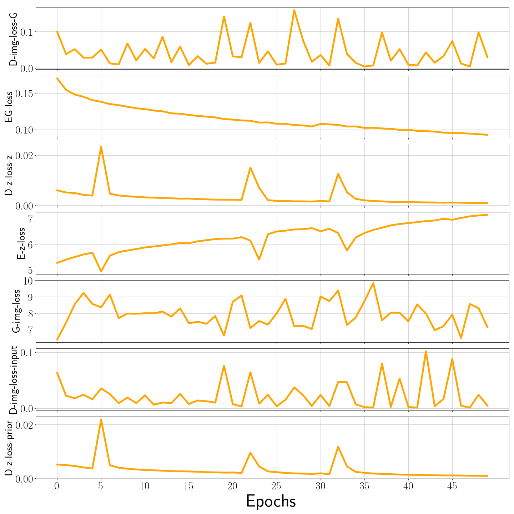

# Age Progression/Regression by Conditional Adversarial Autoencoder (CAAE)

# Repo code structure
* [Report (PDF)](demo/report.pdf): detailed paper and implementation
* [init_model](init_model) contains the model weights
* [main.py](main.py): main file
* [ops.py](ops.py): helper wrapper functions for NNs
* [FaceAging.py](FaceAging.py): Face Aging networks

Utilising the TensorFlow implementation (from https://github.com/ZZUTK/Face-Aging-CAAE) of the algorithm in the paper [Age Progression/Regression by Conditional Adversarial Autoencoder](http://web.eecs.utk.edu/~zzhang61/docs/papers/2017_CVPR_Age.pdf).

<p align="center">
  
</p>

## Pre-requisites
Revamped for the following usage:
* Python 3.5.2 (original was 2.7x)
* Scipy 1.0.0
* Tensorflow-gpu 1.14 (original used 1.7.0)

## Datasets
* https://github.com/JingchunCheng/All-Age-Faces-Dataset (aligned faces)

## preliminary Results
* 
The training process has been tested on Google Cloud Platform NVIDIA Tesla P100 NVIDIA. The training time for 50 epochs on 13k images is roughly 3h.

## Custom Training
```
$ python main.py
    --dataset		default 'asian-faces'. Please put your own dataset in ../data
    --savedir		default 'save'. Please use a meaningful name, e.g., save_init_model.
    --epoch		default 50.
    --use_trained_model	default True. If use a trained model, savedir specifies the model name.
    --use_init_model	default True. If load the trained model failed, use the init model save in ./init_model
```

## Testing
```
$ python main.py --is_train False --testdir your_image_dir --savedir save
```


## A demo of training process

## Files
* [`FaceAging.py`](FaceAging.py) is a class that builds and initializes the model, and implements training and testing related stuff
* [`ops.py`](ops.py) consists of functions called `FaceAging.py` to implement options of convolution, deconvolution, fully connection, leaky ReLU, load and save images.   
* [`main.py`](main.py) demonstrates `FaceAging.py`.

## References
[Zhifei Zhang](http://web.eecs.utk.edu/~zzhang61/), [Yang Song](http://web.eecs.utk.edu/~ysong18/), and [Hairong Qi](https://www.eecs.utk.edu/people/faculty/hqi/). "Age Progression/Regression by Conditional Adversarial Autoencoder." *IEEE Conference on Computer Vision and Pattern Recognition (CVPR)*, 2017.
```
@inproceedings{zhang2017age,
  title={Age Progression/Regression by Conditional Adversarial Autoencoder},
  author={Zhang, Zhifei and Song, Yang and Qi, Hairong},
  booktitle={IEEE Conference on Computer Vision and Pattern Recognition (CVPR)},
  year={2017}
}
```
